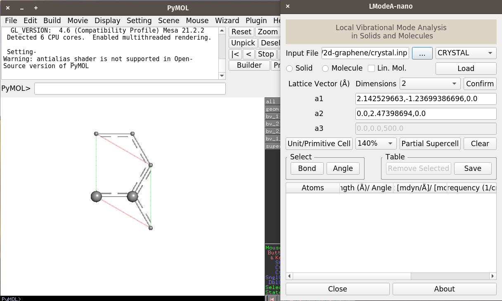
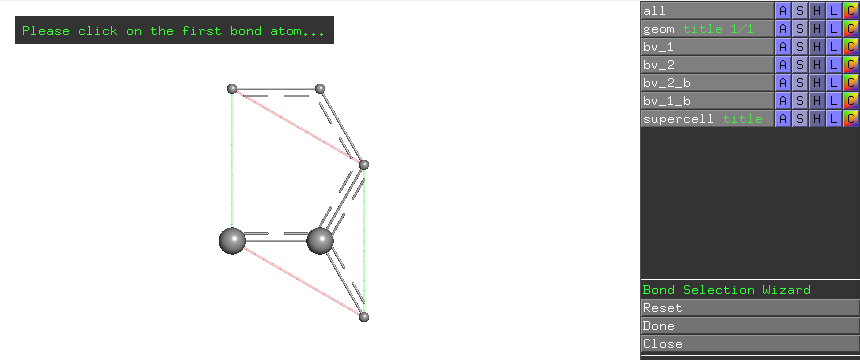
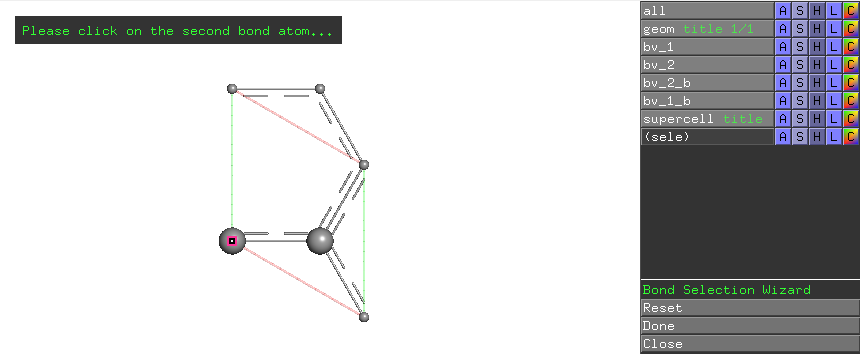
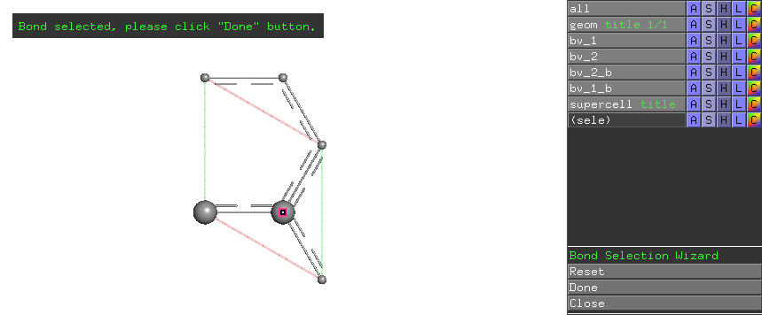
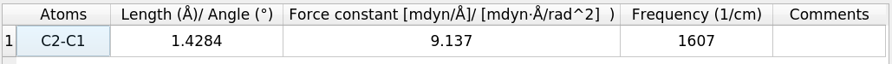
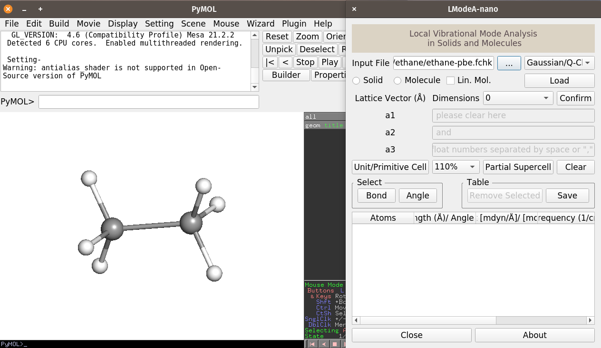
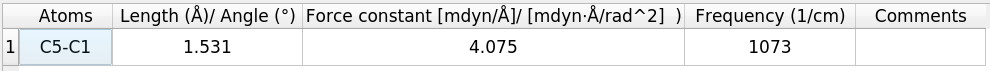

.. _quick-example:
..    include:: <isonum.txt>

.. toctree::
   :hidden:

===================
Quickstart Examples
===================

The following two examples may familiarize you with the use of ``LModeA-nano``.

2D Graphene calculated by CRYSTAL17
-----------------------------------

In the ``LModeA-nano-main/quickstart/graphene`` directory, two files were generated by the vibrational frequency calculation with CRYSTAL17 program

* ``crystal_21991013.out`` - CRYSTAL output file of vibrational analysis 

* ``HESSFREQ.DAT`` - Hessian file generated after vibrational analysis calculation

In the same directory, we compose an input file ``crystal.inp`` for LModeA-nano

.. code:: text

   @crystal

   OUTPUT = crystal_21991013.out
   HESSFREQ = HESSFREQ.DAT

.. After launching PyMOL and the LModeA-nano plugin by clicking **Plugin** |rarr| **LModeA-nano**,  

Following these steps

* open a new PyMOL window and launch LModeA-nano by clicking **Plugin** |rarr| **LModeA-nano**
 
* click the **... (Browse)** button and select the ``crystal.inp`` file

* change the program drop-down list from **VASP** to **CRYSTAL**

* click **Load**

* change **Dimensions** to ``2`` and click **Confirm** button

* change the supercell size percentage from ``110%`` to ``140%`` and click **Partial Supercell** button

We will see the structure like the following 

|

The PyMOL window shows the graphene primitive cell having two carbon atoms (with larger radii) and other carbon atoms belong to neighboring unit cells. 

To do local vibrational mode analysis of CC bonds in this structure, click the **Bond** button in the LModeA-nano window. The interactive wizard may ask for the selection of the first atom of a bond

|
Click the left carbon atom in the primitive cell, the wizard prompts the selection of the second atom of a bond

|
Click the right carbon atom in the primitive cell, the wizard prompts clicking **Done** button in the wizard menu on the right-hand-side.

|
Afterwards, the local mode analysis result for this CC bond is shown in the table region of the LModeA-nano GUI window.

|
Users are encouraged to try to select a different CC bond in this example for local mode analysis, the result is expected to be the same as for C1-C2 due to symmetry in graphene structure.

.. _quick-qc:

Ethane calculated by Gaussian 16
--------------------------------

In the ``LModeA-nano-main/quickstart/ethane`` directory, a formatted checkpoint file ``ethane-pbe.fchk`` was generated by the vibrational analysis (freq) calculation in Gaussian 16 package. 

For this type of input data file, it can be directly loaded to LModeA-nano. 

Following these steps

* open a new PyMOL window and launch LModeA-nano by clicking **Plugin** |rarr| **LModeA-nano**
 
* click the **... (Browse)** button and select the ``ethane-pbe.fchk`` file

* change the program drop-down list from **VASP** to **Gaussian/Q-Chem**

* click **Load**

* change **Dimensions** to ``0`` and click **Confirm** button

We will see the following

|
By selecting the CC bond for local mode analysis, the result is 

|

   
